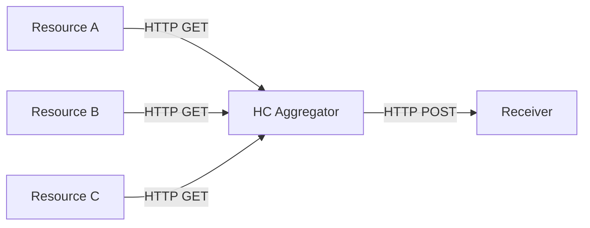

# HealthCheck Aggregator
A service that polls health checks across a set of resources and produces an aggregated health check for the consumer with details on each of the components.

## Overview
The Health Check Aggregator Service is a robust tool designed for monitoring the health and status of various system components. 
It periodically polls individual health checks from a predefined set of resources and provides an aggregated health status to consumers. 
This service is essential for maintaining the reliability and availability of systems in real-time.

If all components are unavailable, the health check is not conducted.

### Simplified diagram


### Output message example

```json
{
  "timestamp": "2023-12-21T12:34:56Z",
  "healthCheck": {
    "subSystems": [
      {
        "name": "Resource A",
        "status": "Healthy"
      },
      {
        "name": "Resource B",
        "status": "Healthy"
      },
      {
        "name": "Resource C",
        "status": "Unhealthy"
      }
    ]
  }
}
```
### Recources configuration

| Field         | Description                                                                         |
| ------------- | ----------------------------------------------------------------------------------- |
| name          | The name of the resource or service to be checked.                                   |
| url           | The URL where the health check request should be made.                              |
| crawlInterval | The time interval between health check requests.|
| statusTimeout | The maximum time to wait for a response when requesting the status.|


```json
{
  "resources": [
    {
      "name": "Resource A",
      "url": "http://exampleA.com/hc",
      "crawlInterval": "00:30:00.000",  
      "statusTimeout": "00:00:10.000"   
    },
    {
      "name": "Resource B",
      "url": "http://exampleB.com/hc",
      "crawlInterval": "00:15:00.000", 
      "statusTimeout": "00:00:15.000"  
    },
    {
      "name": "Resource C",
      "url": "http://exampleC.com/hc",
      "crawlInterval": "00:01:00.000",  
      "statusTimeout": "00:00:20.000"
    }
  ]
}
```

### Configuration for Sending Aggregated Health Check HTTP POST Messages

| Parameter        | Value               | Description                                          |
|------------------|---------------------|------------------------------------------------------|
| `recipient_url`  | `https://target`    | The address to which the HTTP POST message will be sent. |
| `interval`       | `00:00:15.000`      | The time interval between sending messages. In this case, a message will be sent every 15 seconds. |
| `timeout`        | `00:00:05.000`       | The maximum waiting time for a response from the server after sending the message.|

```json
{
  "recipient_url": "https://target",
  "interval": "00:00:15.000",
  "timeout": "00:00:5.000"
}
```

