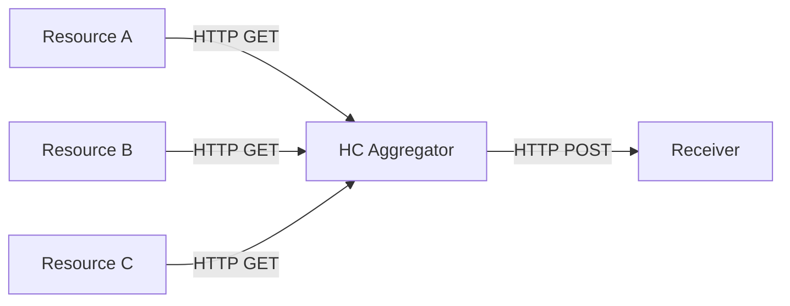

# HealthCheck Aggregator
A service that polls health checks across a set of resources and produces an aggregated health check for the consumer with details on each of the components.

## Overview
The Health Check Aggregator Service is a robust tool designed for monitoring the health and status of various system components. 
It periodically polls individual health checks from a predefined set of resources and provides an aggregated health status to consumers. 
This service is essential for maintaining the reliability and availability of systems in real-time.

If all components are unavailable, the health check is not conducted.

### Simplified diagram


### Output message example

```json
{
   "timestamp":"2023-12-25T15:11:16.1792083+00:00",
   "resources":[
      {
         "resource_name":"Resource A",
         "resource_status":"healthy"
      },
      {
         "resource_name":"Resource B",
         "resource_status":"healthy"
      },
      {
         "resource_name":"Resource C",
         "resource_status":"unhealthy"
      }
   ]
}
```
### Resources configuration

| Field         | Description                                                                         |
| ------------- | ----------------------------------------------------------------------------------- |
| Name          | The name of the resource or service to be checked.                                   |
| ExpirationPeriod | Time until health check is considered obsolete.|
| Url           | The Uri where the health check request should be made.                              |
| CheckInterval | The time interval between health check requests.|
| Timeout | The maximum time to wait for a response when requesting the status.|


```json
{
 "Resources": [
   {
     "Name": "Resource A",
     "ExpirationPeriod": "00:01:00",
     "Url": "https://localhost:7211/hc",
     "CheckInterval": "00:00:30",
     "Timeout": "00:00:15"
   },
   {
     "Name": "Resource B",
     "ExpirationPeriod": "00:00:15",
     "Url": "https://localhost:7212/hc",
     "CheckInterval": "00:00:10",
     "Timeout": "00:01:00"
   }
 ]
}
```

### Configuration for Sending Aggregated Health Check HTTP POST Messages

| Parameter        | Description                                          |
|------------------|------------------------------------------------------|
| Url  | The address to which the HTTP POST message will be sent. |
| Timeout      | The maximum waiting time for a response from the server after sending the message.|

```json
{
"ReportSenderConfiguration": {
    "Url": "https://localhost:7210/report",
    "Timeout": "00:00:15"
  }
}
```

### Configuration for period of Sending Aggregated Health Check HTTP POST Messages

| Parameter        | Description                                          |
|------------------|------------------------------------------------------|
| SendInterval       | The time interval between sending messages.|

```json
{
"ReportProcessorConfiguration": {
  "SendInterval": "00:00:30"
}
}
```
