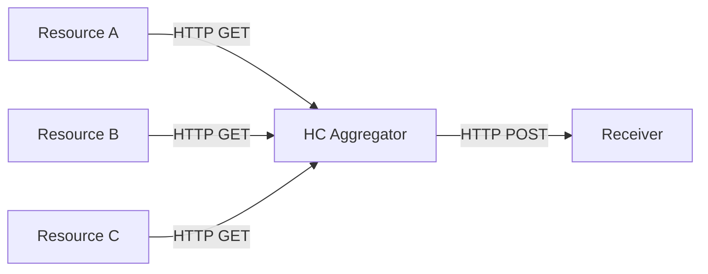

# HealthCheck Aggregator
A service that polls health checks across a set of resources and produces an aggregated health check for the consumer with details on each of the components.

## Overview
The Health Check Aggregator Service is a robust tool designed for monitoring the health and status of various system components. 
It periodically polls individual health checks from a predefined set of resources and provides an aggregated health status to consumers. 
This service is essential for maintaining the reliability and availability of systems in real-time.

If all components are unavailable, the health check is not conducted.

### Simplified diagram


### Output message example

```json
{
  "timestamp": "2023-12-21T12:34:56Z",
  "healthCheck": {
    "subSystems": [
      {
        "name": "Resource A",
        "status": "Healthy"
      },
      {
        "name": "Resource B",
        "status": "Healthy"
      },
      {
        "name": "Resource C",
        "status": "Unhealthy"
      }
    ]
  }
}
```
